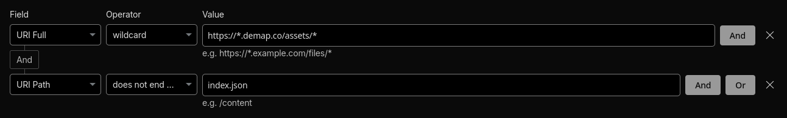

Diadem proxies all external resources through its own server, so your users don't have to directly hit external links,
and so it can optimize the resources.

## UIcons

Diadem serves your configured UIcons on `/assets/{id}`. Icons are optimized, converted to WebP, and optionally scaled
to width 64. It sets caching headers, so your clients will cache the icons locally.

- `/assets/home/pokemon/25.png?w=64` returns the HOME icon for Pikachu, scaled to width 64 (cached by clients for 120 days)
- `/assets/home/index.json` serves the UIcon index for the HOME icon set

## Internal resources

- `/api/stats`: Index about what's currently available in-game
- `/api/pogodata`: Index about in-game metadata (cached by clients for 1 hour)
- `/api/supported-features`: Features supported by your Diadem instance
- `/api/koji`: Your Koji areas (if set up)
- `/api/config`: your client config

## Set up Cloudflare Cache Rules

These are a lot of resources that rarely change, so setting up a CDN for them makes a lot of sense. For the UIcon
endpoints, it's almost essential for a well-running map.

This is how you can proxy your UIcon images through Cloudflare's CDN.
This assumes you're already proxying Diadem through Cloudflare.

1. From your site dashboard navigate to Caching → Cache Rules
2. Create a rule
   
3. You can now configure how long you want the images to last on Cloudflare's server (Edge TTL) and how long in your
   user's browsers (Browser TTL)

You can set up similar rules for icon set indexes and the internal resources listed above.
